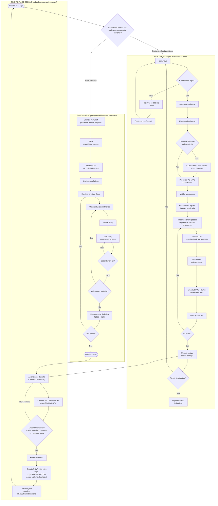

# Fluxograma — criar software novo ou feature nova

## Legenda rápida
- **Verde (topo):** só quando é projeto do ZERO — PRD → Architecture → Épicos → Stories, ciclo BMad completo.
- **Azul (meio):** o dia a dia deste e de outros projetos já em andamento — é o fluxo que mais vamos usar.
- **Amarelo (base):** roda o tempo todo, em paralelo — não é uma fase, é a disciplina de não perder aprendizado e de saber quando trocar de sessão.
